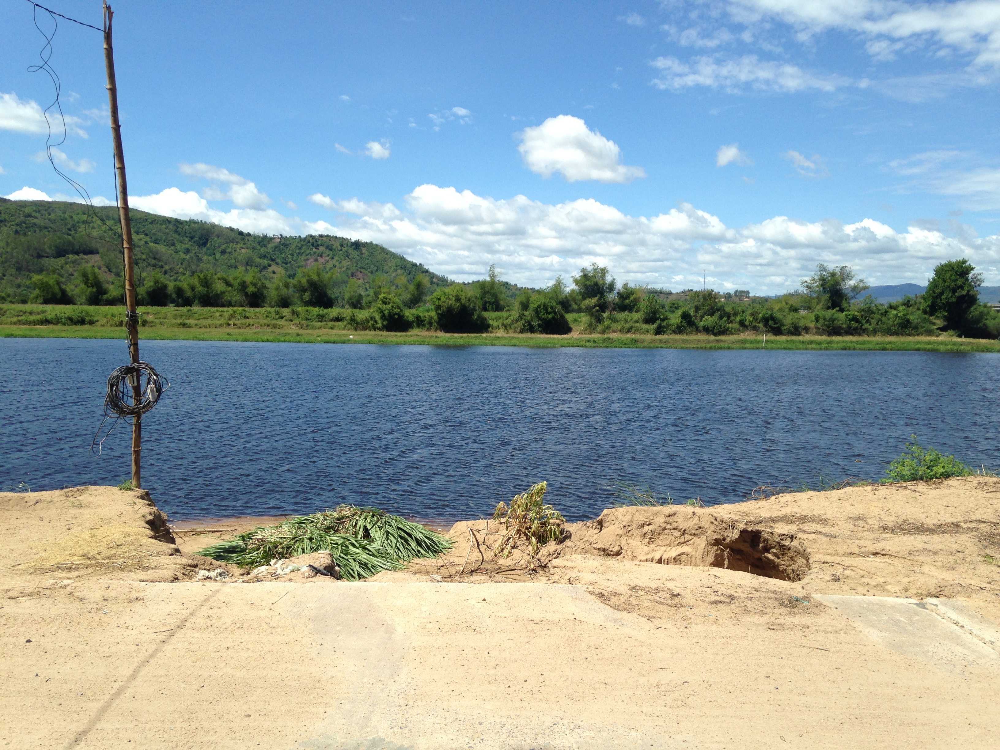

+++
tags = "tản văn, 🇻🇳"
date = "3 December, 2024"
+++

# Ngày nắng hè

Trích một đoạn trong "Khói trời lộng lẫy" của chị Tư ([Nguyễn Ngọc Tư](https://www.facebook.com/nguyenngoc4)). Dù chị Tư sinh năm 1976, nghĩa là lớn hơn tôi tận 18 tuổi, nhưng gọi chị là chị vì văn chị trẻ dữ quá. Chị Tư viết sao giản dị mà lại thiệt tình, nghe hay lắm.

_Tôi thấy mình nghèo quá, mình chỉ có tình thương. Tôi chỉ có thể hứa những lời hứa nghèo, chừng nào hái bí mẹ mua cho con bộ đồ mới, chừng nào con lớn mẹ sẽ cho đi chơi thành phố, chừng nào kiếm nhiều tiền mẹ mua chiếc xe đạp cho con chạy lòng vòng cồn chơi. Hoặc lời hứa mịt mù kiểu như "nghe lời mẹ rồi mẹ thương…"._

Đọc đoạn này tôi cứ miên man nhớ về ngày tháng bé xíu. Hình ảnh xóm Bầu hiện lên trong tôi vẫn luôn là những ngày nắng, gió lộng. Cũng có lẽ vì thế mà tôi lấy tựa "Ngày nắng hè" là thích hợp nhất cho những đoạn bình dị này.

