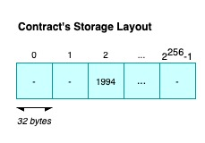
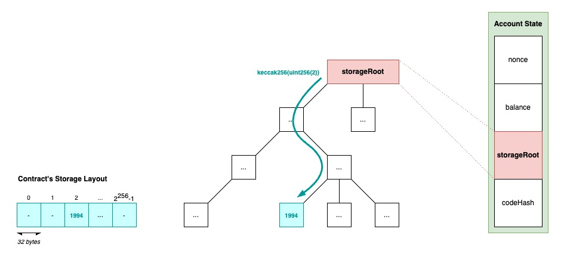
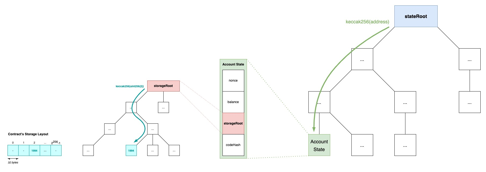
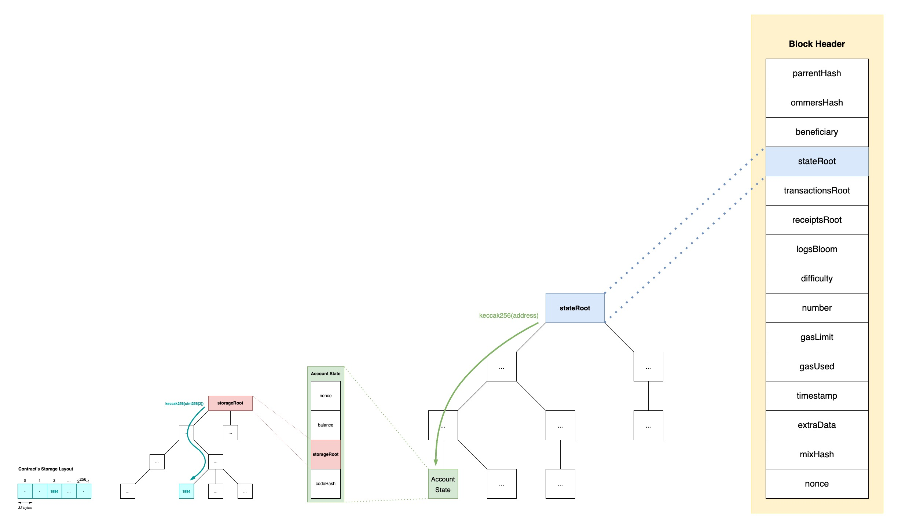

+++
tags = "web3, evm, 🇻🇳"
date = "22 August, 2024"
+++

# Giải mã bố cục dữ liệu của Ethereum

Khi đang tìm hiểu về quá trình kiểm tra dữ liệu của Optimism, trong tôi luôn có một câu hỏi rằng "Trạng thái được lưu trong `calldata` trông như thế nào?". Vì vậy, tôi đã quyết định giải quyết tất cả điều bí ẩn đằng sau những từ ngữ hoa mỹ như "Merkle Trie" hoặc "Merkle Patricia Trie" trong bài viết này một lần và mãi mãi.

# Bộ nhớ của Contract

Tất cả các biến với độ dài cố định sẽ được trải ra liên tiếp nhau trên **storage slots**[^1]. Mỗi storage slot sẽ có số thứ tự chạy từ $0$ đến $2^{256}-1$ và đồng thời trỏ đến một vùng nhớ 32 bytes. Nhiều biến với độ dài cố định (trừ `struct` và `array`) có thể được lưu trên cùng một storage slot miễn là tổng độ dài vừa đủ trong một ô nhớ. Tuy nhiên, `struct` và `array` sẽ luôn chiếm một storage slot mới trong khi các phần tử của chúng vẫn sẽ tuân theo quy luật ban đầu. Trong trường hợp các contract kết thừa nhau, các vị trí ô nhớ sẽ tuân theo luật [C3 linearization](https://en.wikipedia.org/wiki/C3_linearization).

Các biến có độ dài biến động bao gồm `mapping` và `array` độ dài không xác định sẽ sử dụng Keccak-256 để tìm ra vị trí ô nhớ bắt đầu. Với một `array` ở vị trí `p`, storage slot thứ `p` sẽ lưu giá trị số lượng phần tử trong mảng và dữ liệu mảng thì sẽ được lưu ở vị trí `keccak256(p)`. Với một `mapping` ở vị trí `p`, storage slot thứ `p` sẽ không lưu gì cả và dữ liệu của khoá `k` sẽ đặt ở vị trí `keccak256(k|p)`, trong đó `|` là hàm nối mảng.

Lấy ví dụ,

```solidity label="layout.sol" group="layout"
// SPDX-License-Identifier: GPL-3.0
pragma solidity >=0.4.0 <0.7.0;

contract C {
    struct S { uint a; uint b; } // Đây là kiểu dữ liệu, không phải biến
    uint x; // Storage slot vị thứ 0
    mapping(uint => mapping(uint => S)) data; // Storage slot vị thứ 1 sẽ rỗng
}
```

Storage slot của `data[4][9]` sẽ bắt đầu tại:

$$
\begin{align*}
&x = \textcolor{red}{keccak256(}\\
& \quad uint256(9) \mid \textcolor{green}{keccak256(}\\
& \qquad uint256(4) \mid uint256(1)\\
& \quad \textcolor{green}{)}\\
&\textcolor{red}{)}
\end{align*}
$$

Ngoài ra, dữ liệu của `data[4][9].a` sẽ đặt tại $x$ và dữ liệu của `data[4][9].b` sẽ đặt tại $x+1$.

Tất cả những kiến thức trên thực sự không cần quá để tâm. Điều chúng ta cần lưu ý ở đây là dữ liệu của contract được hình thành dưới dạng một dải các ô nhớ 32 bytes. Trong đó, $key$ sẽ là một số nguyên 32 bytes và $value$ sẽ mà một số nguyên 32 bytes với [Mã hoá RLP](https://ethereum.org/en/developers/docs/data-structures-and-encoding/rlp/).



---

# Account State

Một Account State[^1] bao gồm $nonce$, $balance$, $storageRoot$, và $codeHash$. Tập trung vào $storageRoot$, nó chính là giá trị hash gốc của [Cây Merkle Patricia](https://ethereum.org/en/developers/docs/data-structures-and-encoding/patricia-merkle-trie/) (MPT). Như chúng ta biết rằng với một cặp $(key,value)$, $key$ sẽ đại diện cho đường dẫn đến node lá và $value$ sẽ chính là nội dung của node lá. Kết hợp hiểu biết này với [Bộ nhớ của Contract](#bộ-nhớ-của-contract), một storage slot vị thứ `p` với giá trị `value` sẽ được mã hoá thành cặp $(keccak256(p), RLP(value))$ trước khi thêm vào cây MPT.



---

# World State

Một [Account State](#account-state) sẽ được giữ bởi một địa chỉ dài 20 bytes. Điều đó sẽ cho ra một tài khoản dưới dạng:

$$
\begin{align*}
&(\\
&\quad keccak256(addr),\\
&\quad RLP(\\
&\qquad nonce,\\
&\qquad balance,\\
&\qquad storageRoot,\\
&\qquad codeHash\\
&\quad)\\
&)
\end{align*}
$$

Tất cả các tài khoản trên thế giới sẽ được tổ chức vào trong một cây MPT và cuối cùng cho ra một $stateRoot$.



> Ngoài ra, còn có thêm 2 cây nữa là Transaction Trie, và Transaction Receipt Trie, mà tôi tin rằng chúng được cấu tạo với mô hình tường tự như World State Trie.

---

# Block Header

Đưa giá trị của [World State](#world-state) cùng với một số giá trị khác vào trong một block header[^1].



---

# Back to Optimism

Thay vì thực thi giao dịch trực tiếp[^2] trên Layer 1[^1] và phụ thuộc vào tốc độ của nó, Optimism lại thực thi các giao dịch này gián tiếp[^3] đồng thời chỉ gửi các ghi chú lên Layer 1 (cụ thể là Ethereum) như là một bằng chứng cho quá trình thực thi và xác nhận để giảm thiểu đáng kể các chi phí thực thi. Các ghi chú này cụ thể là các trạng thái được lưu trong `calldata` của những giao dịch trực tiếp.

Các trạng thái được lưu:

**Output Root.**[^1] Nó là một chuỗi 32 bytes với giá trị là $keccak256(versionByte \mid payload)$. Trong đó, $versionByte$ sẽ là một chuỗi 32 bytes đơn giản thể hiện phiên bản của [L2 Output Commitment](https://specs.optimism.io/protocol/proposals.html#l2-output-root-proposals-specification), và $payload$ là

$$
\begin{align*}
payload =& \; stateRoot\\
\mid& \; withdrawalStorageRoot\\
\mid& \; latestBlockHash
\end{align*}
$$

**Batch.**[^1] Nó là kết quả của phép nối mảng $(batchVersion \mid content)$ với

$$
\begin{align*}
&content = RLP(\\
& \quad parentHash,\\
& \quad epochNumber,\\
& \quad epochHash,\\
& \quad timestamp,\\
& \quad transactionList\\
&)
\end{align*}
$$

[^1]: Từ này sẽ được giữ nguyên gốc như là một danh từ thay vì dịch ra nghĩa Tiếng Việt.

[^2]: trực tiếp = on-chain.

[^3]: gián tiếp = offchain.
